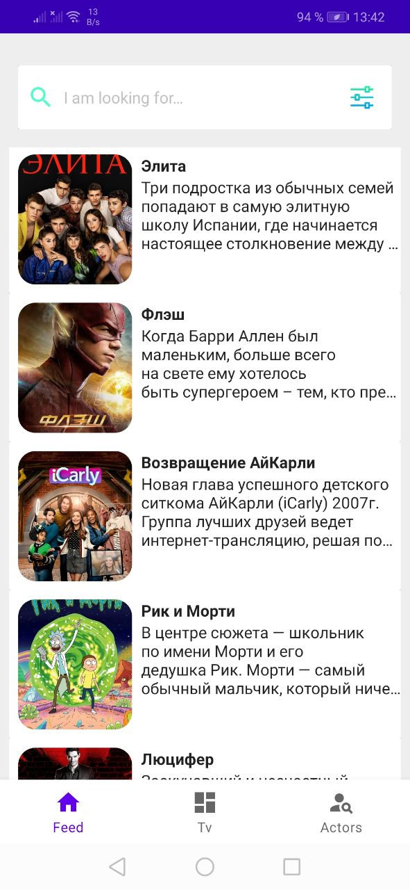
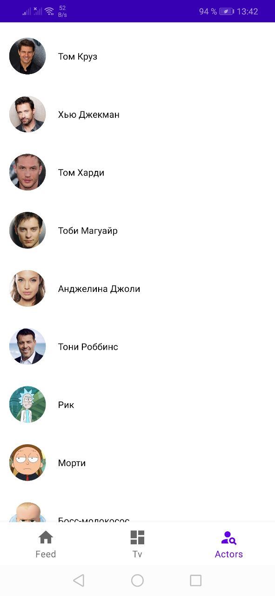
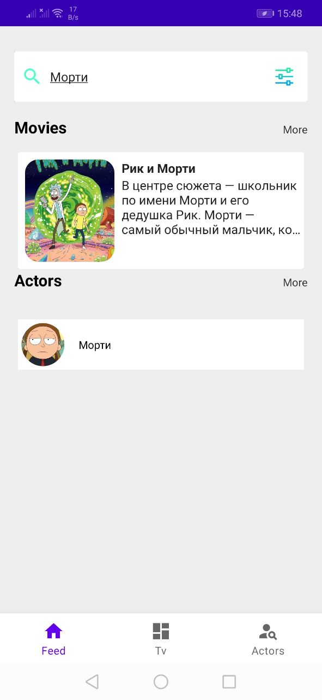

# Демо-приложение для знакомства с App Search Library
Это проект, выполненный для демонстрации работы [AppSearch](https://developer.android.com/guide/topics/search/appsearch#kotlin)

## Приложение позволяет:

- Просматривать список сериалов, актёров
- Сохраняет их в локальный кэш
- Осуществляет поиск через AppSearch
- Выводит разные результаты в единый список

## В проекте используются следующие библиотеки и фрэймворки 📚:
- Groupie для построения сложных списков на базе RecyclerView. [Подробнее](https://github.com/lisawray/groupie)
- Android Navigation для навигации между экранами. [Подробнее](https://developer.android.com/guide/navigation/navigation-getting-started)
- AppSearch для локального мультипоиска среди всех документов. [Подробнее](https://developer.android.com/guide/topics/search/appsearch#kotlin)
- RxJava для асинхронной работы. [Подробнее](https://github.com/ReactiveX/RxJava)

